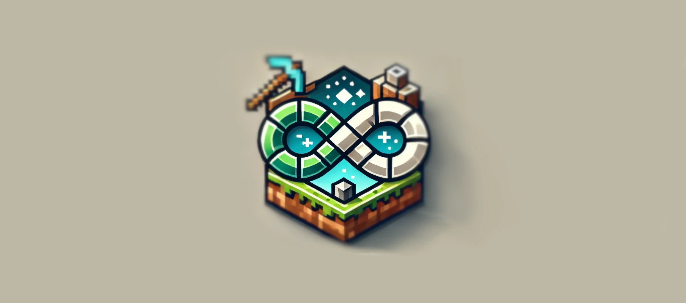

# HardLoop


<p align="center">
    
</p>

## About Hardloop
Hardloop is a dynamic Minecraft server project designed with an emphasis on infinite gameplay loops and automated server resets. Whether you're a server administrator looking for a robust solution to manage player deaths or a developer interested in how to automate and manage server resets, Hardloop offers a streamlined approach with a variety of custom features.

## Key Features
- Automated Server Resets: The server automatically resets when a player dies, ensuring a fresh start every time.
- Customizable MOTD: Each server reset updates the Message of the Day (MOTD) to reflect the latest player death and reset count.
- Infinite Loop Concept: The server is built around the idea of endless gameplay loops, providing a unique experience where the challenge is to survive as long as possible.
- Easy Setup: Hardloop is designed to be easy to install and configure, making it accessible for both beginners and experienced server admins.
- Flexible and Open Source: Licensed under [Your Chosen License], Hardloop is free to use, modify, and distribute. Contributions are welcome!

## Getting Started
To get started with Hardloop, simply clone the repository and customize the docker-compose.yaml, including the MOTD, to fit your server's theme and requirements.
Then, you can build and run the server using the following commands:

```bash
docker-compose build
docker-compose up
```

## License
This project is licensed under the MIT License. See the LICENSE file for details.

## Contributing
Contributions are welcome! If you'd like to contribute to Hardloop, please fork the repository, create a new branch, and submit a pull request. For major changes, please open an issue first to discuss what you would like to change.

## Credits
Hardloop was created by Louis LABEYRIE and Dorian TETU.
